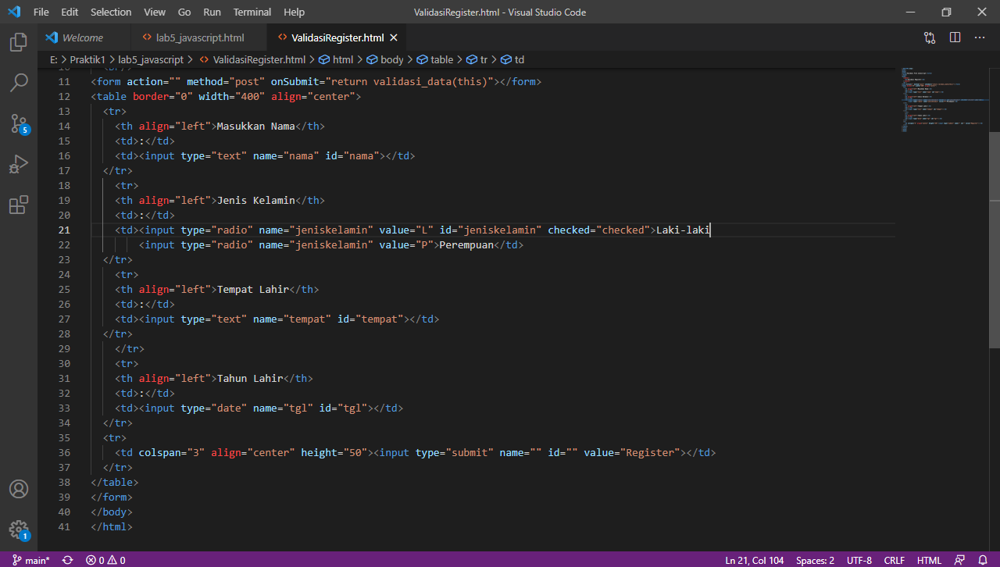

# Lab5Web

## Belajar Membuat Javascript di HTML

##### Nama : Windy Septiani
##### NIM  : 311910673

### Menjawab Pertanyaan Tugas Praktik 5
#### 1. Buat script untuk melakukan validasi pada isian form.
Gambar code untuk validasi pada isian form

Gambar tampilan di browser

### Praktik Membuat Javascript di HTML
#### File Lab5_javascript.html
##### Code untuk membuat halaman pertama

##### Tampilan di Browser

##### Code untuk Pemakaian Alert sebagai property window

###### Code Membuat Pemakaian method dalam objek

###### Tampilan di Browser

##### Code Operasi dasar aritmatika

##### Tampilan di Browser

##### Code Seleksi kondisi (if..else)

##### Tampilan di Browser

##### Code Penggunaan operator switch untuk seleksi kondisi

##### Tampilan di Browser

##### Code Pembuatan Form Input

##### Code Pembuatan Form Button

##### Tampilan di Browser

##### Code Pilihan menggunakan checkBox dengan perhitungan otomatis

##### Tampilan di Browser
